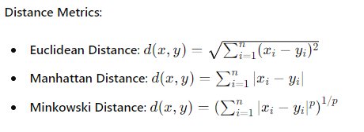

# K - Nearest Neighbors (KNN)

### Table of Contents
1. Introduction to K-Nearest Neighbors
2. How KNN Works
3. Advantages and Disadvantages of KNN
4. Key Concepts in KNN
5. Data Preprocessing for KNN
6. Building a KNN Model
7. Hyperparameter Tuning in KNN
8. Evaluating KNN Model Performance
9. Handling Imbalanced Data
10. Advanced Techniques and Best Practices
11. Case Study: Predicting Iris Species using KNN
12. Case Study: Predicting Employee Attrition using KNN
13. Conclusion

---

### 1. Introduction to K-Nearest Neighbors

**K-Nearest Neighbors (KNN)** is a simple, non-parametric, and lazy learning algorithm used for classification and regression tasks. It assumes that similar things exist in close proximity, making predictions based on the 'k' most similar training examples.

---

### 2. How KNN Works

1. **Choose the number of K and a distance metric**: Common choices for distance metrics are Euclidean, Manhattan, and Minkowski distances.
2. **Compute the distance**: For a given test instance, compute the distance to all training samples.
3. **Select K-nearest neighbors**: Identify the K training samples that are closest to the test instance.
4. **Vote for labels**: In classification, the label that occurs most frequently among the K-nearest neighbors is assigned to the test instance. In regression, the mean of the K-nearest neighbors is used.

---

### 3. Advantages and Disadvantages of KNN

**Advantages**:
- Simple and easy to understand.
- No training phase (lazy learner).
- Versatile: applicable to classification and regression.

**Disadvantages**:
- Computationally expensive during prediction.
- Sensitive to irrelevant or redundant features.
- Performance depends on the choice of K and distance metric.
- Sensitive to the scale of the data.

---

### 4. Key Concepts in KNN



**Choosing K**:
- A small value of K can be noisy and lead to overfitting.
- A large value of K can smooth out predictions but may overlook local patterns.

**Normalization**:
- Important for ensuring all features contribute equally to the distance computation.

---

### 5. Data Preprocessing for KNN

**Data Cleaning**: Handle missing values and outliers.

**Feature Scaling**: Standardize or normalize features to ensure fair distance computation.

**Encoding Categorical Variables**: Convert categorical variables to numerical values using techniques like one-hot encoding.

**Splitting Data**: Divide data into training and testing sets.

```python
import pandas as pd
from sklearn.model_selection import train_test_split
from sklearn.preprocessing import StandardScaler

# Example data preprocessing
df = pd.read_csv('data.csv')
df.fillna(df.mean(), inplace=True)

# Encoding categorical variables
df = pd.get_dummies(df)

# Splitting data
X = df.drop('Target', axis=1)
y = df['Target']
X_train, X_test, y_train, y_test = train_test_split(X, y, test_size=0.2, random_state=42)

# Feature scaling
scaler = StandardScaler()
X_train = scaler.fit_transform(X_train)
X_test = scaler.transform(X_test)
```

---

### 6. Building a KNN Model

**Step-by-Step Guide**:

1. **Import Libraries**:
    ```python
    from sklearn.neighbors import KNeighborsClassifier
    from sklearn.metrics import accuracy_score
    ```

2. **Initialize KNN Model**:
    ```python
    knn = KNeighborsClassifier(n_neighbors=5)
    ```

3. **Train Model**:
    ```python
    knn.fit(X_train, y_train)
    ```

4. **Predict and Evaluate**:
    ```python
    y_pred = knn.predict(X_test)
    accuracy = accuracy_score(y_test, y_pred)
    print(f"Accuracy: {accuracy * 100:.2f}%")
    ```

---

### 7. Hyperparameter Tuning in KNN

**Hyperparameters**:
- **Number of Neighbors (K)**: Determines the number of nearest neighbors to use.
- **Distance Metric**: Choose the appropriate distance metric for your data.
- **Weight Function**: Uniform weights or weights based on distance.

Use Grid Search for tuning:

```python
from sklearn.model_selection import GridSearchCV

param_grid = {
    'n_neighbors': [3, 5, 7, 9],
    'weights': ['uniform', 'distance'],
    'metric': ['euclidean', 'manhattan']
}

grid_search = GridSearchCV(KNeighborsClassifier(), param_grid, cv=5, scoring='accuracy')
grid_search.fit(X_train, y_train)

print(f"Best parameters: {grid_search.best_params_}")
print(f"Best score: {grid_search.best_score_}")
```

---

### 8. Evaluating KNN Model Performance

**Common Evaluation Metrics**:
- **Accuracy**: Proportion of correct predictions.
- **Precision**: Proportion of positive identifications that are actually correct.
- **Recall**: Proportion of actual positives that are correctly identified.
- **F1 Score**: Harmonic mean of precision and recall.
- **Confusion Matrix**: Visual representation of the performance of the classification algorithm.

Example of calculating evaluation metrics:

```python
from sklearn.metrics import classification_report, confusion_matrix

print(classification_report(y_test, y_pred))
print(confusion_matrix(y_test, y_pred))
```

---

### 9. Handling Imbalanced Data

Imbalanced datasets can bias the model towards the majority class. Techniques to handle imbalanced data include:

- **Resampling**: Oversampling the minority class or undersampling the majority class.
- **Synthetic Data Generation**: Techniques like SMOTE (Synthetic Minority Over-sampling Technique).
- **Class Weights**: Adjust the weights of the classes to balance the class distribution.

Example using SMOTE:

```python
from imblearn.over_sampling import SMOTE

sm = SMOTE(random_state=42)
X_res, y_res = sm.fit_resample(X_train, y_train)
```

---

### 10. Advanced Techniques and Best Practices

**Cross-Validation**: Use k-fold cross-validation to ensure your model generalizes well to unseen data.

```python
from sklearn.model_selection import cross_val_score

scores = cross_val_score(knn, X_train, y_train, cv=5)
print(f"Cross-validation scores: {scores}")
print(f"Mean cross-validation score: {scores.mean()}")
```

**Feature Selection**: Select relevant features to improve model performance.

**Scaling Techniques**: Experiment with different scaling techniques like Min-Max scaling, Standard scaling, or Robust scaling.

**Dimensionality Reduction**: Use PCA (Principal Component Analysis) or other techniques to reduce the dimensionality of the data.

---

### 11. Case Study: Predicting Iris Species using KNN

**Step 1: Load and Prepare Data**:

```python
from sklearn.datasets import load_iris

# Load dataset
iris = load_iris()
X, y = iris.data, iris.target

# Splitting data
X_train, X_test, y_train, y_test = train_test_split(X, y, test_size=0.2, random_state=42)

# Feature scaling
scaler = StandardScaler()
X_train = scaler.fit_transform(X_train)
X_test = scaler.transform(X_test)
```

**Step 2: Train KNN Model**:

```python
knn = KNeighborsClassifier(n_neighbors=5)
knn.fit(X_train, y_train)
```

**Step 3: Evaluate the Model**:

```python
y_pred = knn.predict(X_test)
accuracy = accuracy_score(y_test, y_pred)
print(f"Accuracy: {accuracy * 100:.2f}%")

print(classification_report(y_test, y_pred))
print(confusion_matrix(y_test, y_pred))
```

**Step 4: Hyperparameter Tuning**:

```python
param_grid = {
    'n_neighbors': [3, 5, 7, 9],
    'weights': ['uniform', 'distance'],
    'metric': ['euclidean', 'manhattan']
}

grid_search = GridSearchCV(KNeighborsClassifier(), param_grid, cv=5, scoring='accuracy')
grid_search.fit(X_train, y_train)

print(f"Best parameters: {grid_search.best_params_}")
print(f"Best score: {grid_search.best_score_}")
```

---

### 12. Case Study: Predicting Employee Attrition using KNN

**Step 1: Load and Prepare Data**:

```python
import pandas as pd
from sklearn.model_selection import train_test_split
from sklearn.preprocessing import StandardScaler, LabelEncoder

# Load dataset
df = pd.read_csv('p4n_employee.csv')

# Handle missing values
df.fillna(df.mean(), inplace=True)

# Encoding categorical variables
le = LabelEncoder()
df['Gender'] = le.fit_transform(df['Gender'])
df = pd.get_dummies(df)

# Splitting data
X = df.drop('Attrition', axis=1)
y = df['Attr

ition']
X_train, X_test, y_train, y_test = train_test_split(X, y, test_size=0.2, random_state=42)

# Feature scaling
scaler = StandardScaler()
X_train = scaler.fit_transform(X_train)
X_test = scaler.transform(X_test)
```

**Step 2: Train KNN Model**:

```python
knn = KNeighborsClassifier(n_neighbors=5)
knn.fit(X_train, y_train)
```

**Step 3: Evaluate the Model**:

```python
y_pred = knn.predict(X_test)
accuracy = accuracy_score(y_test, y_pred)
print(f"Accuracy: {accuracy * 100:.2f}%")

print(classification_report(y_test, y_pred))
print(confusion_matrix(y_test, y_pred))
```

**Step 4: Hyperparameter Tuning**:

```python
param_grid = {
    'n_neighbors': [3, 5, 7, 9],
    'weights': ['uniform', 'distance'],
    'metric': ['euclidean', 'manhattan']
}

grid_search = GridSearchCV(KNeighborsClassifier(), param_grid, cv=5, scoring='accuracy')
grid_search.fit(X_train, y_train)

print(f"Best parameters: {grid_search.best_params_}")
print(f"Best score: {grid_search.best_score_}")
```

**Step 5: Handling Imbalanced Data**:

```python
from imblearn.over_sampling import SMOTE

sm = SMOTE(random_state=42)
X_res, y_res = sm.fit_resample(X_train, y_train)
knn.fit(X_res, y_res)
y_pred = knn.predict(X_test)

accuracy = accuracy_score(y_test, y_pred)
print(f"Accuracy after SMOTE: {accuracy * 100:.2f}%")
```

---

### 13. Conclusion

K-Nearest Neighbors is a versatile and straightforward algorithm that can be applied to both classification and regression problems. Its simplicity comes with the cost of computational inefficiency during prediction and sensitivity to irrelevant features and the scale of data. Proper data preprocessing, feature selection, and hyperparameter tuning are crucial for achieving the best performance with KNN.

For further reading and advanced techniques, refer to the [official scikit-learn documentation](https://scikit-learn.org/stable/modules/neighbors.html).

