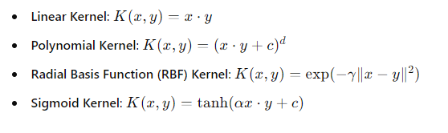

# Support Vector Machine ( SVM )


### Table of Contents
1. Introduction to Support Vector Machine (SVM)
2. How SVM Works
3. Advantages and Disadvantages of SVM
4. Key Concepts in SVM
    - Margin
    - Support Vectors
    - Kernel Trick
5. Types of SVM
6. Data Preprocessing for SVM
7. Building an SVM Model
8. Hyperparameter Tuning in SVM
9. Evaluating SVM Model Performance
10. Handling Imbalanced Data
11. Advanced Techniques and Best Practices
12. Case Study: Predicting Iris Species using SVM
13. Conclusion

---

### 1. Introduction to Support Vector Machine (SVM)

**Support Vector Machine (SVM)** is a supervised machine learning algorithm used for classification and regression tasks. It is particularly well-suited for classification of complex but small- or medium-sized datasets.

---

### 2. How SVM Works

SVM works by finding the hyperplane that best divides a dataset into classes. The optimal hyperplane is the one that maximizes the margin between the two classes. The margin is defined as the distance between the hyperplane and the closest points of the classes, which are called support vectors.

---

### 3. Advantages and Disadvantages of SVM

**Advantages**:
- Effective in high-dimensional spaces.
- Still effective when the number of dimensions is greater than the number of samples.
- Uses a subset of training points in the decision function (called support vectors), making it memory efficient.
- Versatile: different kernel functions can be specified for the decision function.

**Disadvantages**:
- If the number of features is much greater than the number of samples, the method is likely to give poor performances.
- SVMs do not directly provide probability estimates.

---

### 4. Key Concepts in SVM

**Margin**:
- The margin is the distance between the separating hyperplane (decision boundary) and the nearest data points from each class. SVM aims to maximize this margin.

**Support Vectors**:
- Support vectors are the data points that are closest to the separating hyperplane. These points are critical in defining the position and orientation of the hyperplane.

**Kernel Trick**:
- The kernel trick is a technique used to transform data into a higher-dimensional space to make it easier to find a separating hyperplane. Common kernel functions include:



---

### 5. Types of SVM

**Linear SVM**:
- Used for linearly separable data.

**Non-Linear SVM**:
- Uses kernel tricks to handle non-linear data.

**SVM for Regression (SVR)**:
- Used for regression tasks.

---

### 6. Data Preprocessing for SVM

**Data Cleaning**: Handle missing values and outliers.

**Feature Scaling**: Standardize or normalize features to ensure fair distance computation.

**Encoding Categorical Variables**: Convert categorical variables to numerical values using techniques like one-hot encoding.

**Splitting Data**: Divide data into training and testing sets.

```python
import pandas as pd
from sklearn.model_selection import train_test_split
from sklearn.preprocessing import StandardScaler, LabelEncoder

# Example data preprocessing
df = pd.read_csv('data.csv')
df.fillna(df.mean(), inplace=True)

# Encoding categorical variables
df = pd.get_dummies(df)

# Splitting data
X = df.drop('Target', axis=1)
y = df['Target']
X_train, X_test, y_train, y_test = train_test_split(X, y, test_size=0.2, random_state=42)

# Feature scaling
scaler = StandardScaler()
X_train = scaler.fit_transform(X_train)
X_test = scaler.transform(X_test)
```

---

### 7. Building an SVM Model

**Step-by-Step Guide**:

1. **Import Libraries**:
    ```python
    from sklearn.svm import SVC
    from sklearn.metrics import accuracy_score
    ```

2. **Initialize SVM Model**:
    ```python
    svm = SVC(kernel='linear')
    ```

3. **Train Model**:
    ```python
    svm.fit(X_train, y_train)
    ```

4. **Predict and Evaluate**:
    ```python
    y_pred = svm.predict(X_test)
    accuracy = accuracy_score(y_test, y_pred)
    print(f"Accuracy: {accuracy * 100:.2f}%")
    ```

---

### 8. Hyperparameter Tuning in SVM

**Hyperparameters**:
- **C (Regularization parameter)**: Controls the trade-off between achieving a low error on the training data and minimizing the norm of the weights.
- **Kernel**: Specifies the kernel type to be used in the algorithm.
- **Gamma**: Kernel coefficient for ‘rbf’, ‘poly’, and ‘sigmoid’.

Use Grid Search for tuning:

```python
from sklearn.model_selection import GridSearchCV

param_grid = {
    'C': [0.1, 1, 10, 100],
    'gamma': [1, 0.1, 0.01, 0.001],
    'kernel': ['rbf', 'poly', 'sigmoid']
}

grid_search = GridSearchCV(SVC(), param_grid, cv=5, scoring='accuracy')
grid_search.fit(X_train, y_train)

print(f"Best parameters: {grid_search.best_params_}")
print(f"Best score: {grid_search.best_score_}")
```

---

### 9. Evaluating SVM Model Performance

**Common Evaluation Metrics**:
- **Accuracy**: Proportion of correct predictions.
- **Precision**: Proportion of positive identifications that are actually correct.
- **Recall**: Proportion of actual positives that are correctly identified.
- **F1 Score**: Harmonic mean of precision and recall.
- **Confusion Matrix**: Visual representation of the performance of the classification algorithm.

Example of calculating evaluation metrics:

```python
from sklearn.metrics import classification_report, confusion_matrix

print(classification_report(y_test, y_pred))
print(confusion_matrix(y_test, y_pred))
```

---

### 10. Handling Imbalanced Data

Imbalanced datasets can bias the model towards the majority class. Techniques to handle imbalanced data include:

- **Resampling**: Oversampling the minority class or undersampling the majority class.
- **Synthetic Data Generation**: Techniques like SMOTE (Synthetic Minority Over-sampling Technique).
- **Class Weights**: Adjust the weights of the classes to balance the class distribution.

Example using class weights in SVM:

```python
svm = SVC(class_weight='balanced')
```

---

### 11. Advanced Techniques and Best Practices

**Cross-Validation**: Use k-fold cross-validation to ensure your model generalizes well to unseen data.

```python
from sklearn.model_selection import cross_val_score

scores = cross_val_score(svm, X_train, y_train, cv=5)
print(f"Cross-validation scores: {scores}")
print(f"Mean cross-validation score: {scores.mean()}")
```

**Feature Selection**: Select relevant features to improve model performance.

**Scaling Techniques**: Experiment with different scaling techniques like Min-Max scaling, Standard scaling, or Robust scaling.

**Dimensionality Reduction**: Use PCA (Principal Component Analysis) or other techniques to reduce the dimensionality of the data.

---

### 12. Case Study: Predicting Iris Species using SVM

**Step 1: Load and Prepare Data**:

```python
import pandas as pd
from sklearn.datasets import load_iris

# Load dataset
iris = load_iris()
X, y = iris.data, iris.target

# Splitting data
X_train, X_test, y_train, y_test = train_test_split(X, y, test_size=0.2, random_state=42)

# Feature scaling
scaler = StandardScaler()
X_train = scaler.fit_transform(X_train)
X_test = scaler.transform(X_test)
```

**Step 2: Train SVM Model**:

```python
from sklearn.svm import SVC

svm = SVC(kernel='linear')
svm.fit(X_train, y_train)
y_pred = svm.predict(X_test)
```

**Step 3: Evaluate the Model**:

```python
from sklearn.metrics import classification_report, confusion_matrix, accuracy_score

print(classification_report(y_test, y_pred))
print(confusion_matrix(y_test, y_pred))
print(f"Accuracy: {accuracy_score(y_test, y_pred) * 100:.2f}%")
```

**Step 4: Hyperparameter Tuning**:

```python
from sklearn.model_selection import GridSearchCV

param_grid = {
    'C': [0.1, 1, 10, 100],
    'gamma': [1, 0.1, 0.01, 0.001],
    'kernel': ['rbf', 'poly', 'sigmoid']
}

grid_search = GridSearchCV(SVC(), param_grid, cv=5, scoring='accuracy')
grid_search.fit(X_train, y_train)

print(f"Best parameters: {grid_search.best_params_}")
print(f"Best score: {grid_search.best_score_}")
```

**Step 5: Evaluate

 the Tuned Model**:

```python
best_svm = grid_search.best_estimator_
best_svm.fit(X_train, y_train)
y_pred_best = best_svm.predict(X_test)

print(classification_report(y_test, y_pred_best))
print(confusion_matrix(y_test, y_pred_best))
print(f"Accuracy: {accuracy_score(y_test, y_pred_best) * 100:.2f}%")
```

---

### 13. Conclusion

Support Vector Machine (SVM) is a powerful and versatile machine learning algorithm, suitable for both classification and regression tasks. Its ability to handle high-dimensional data and flexibility in choosing different kernel functions make it a popular choice for many applications. Proper data preprocessing, feature selection, and hyperparameter tuning are crucial for achieving the best performance with SVM.

For further reading and advanced techniques, refer to the [official scikit-learn documentation](https://scikit-learn.org/stable/modules/svm.html).

