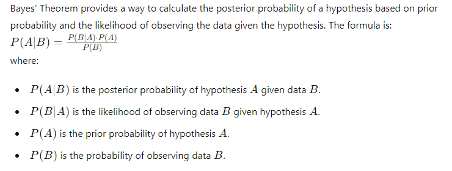

# Naive Bayes Classifier (NBC)


### Table of Contents
1. Introduction to Naive Bayes Classifier (NBC)
2. How Naive Bayes Works
3. Advantages and Disadvantages of Naive Bayes
4. Key Concepts in Naive Bayes
    - Bayes’ Theorem
    - Conditional Independence
    - Types of Naive Bayes Classifiers
5. Data Preprocessing for Naive Bayes
6. Building a Naive Bayes Model
7. Evaluating Naive Bayes Model Performance
8. Handling Imbalanced Data
9. Advanced Techniques and Best Practices
10. Case Study: Predicting Spam Emails using Naive Bayes
11. Conclusion

---

### 1. Introduction to Naive Bayes Classifier (NBC)

**Naive Bayes Classifier (NBC)** is a probabilistic machine learning model used for classification tasks. It is based on Bayes' Theorem, which describes the probability of an event based on prior knowledge of conditions that might be related to the event.

---

### 2. How Naive Bayes Works

Naive Bayes classifiers assume that the presence of a particular feature in a class is unrelated to the presence of any other feature. This assumption is known as **conditional independence**. Despite this assumption being naive and often unrealistic, Naive Bayes classifiers work surprisingly well in practice.

The classification process involves:
1. Calculating the prior probability for each class.
2. Calculating the likelihood of each feature given each class.
3. Using Bayes' Theorem to compute the posterior probability for each class.
4. Assigning the class with the highest posterior probability to the instance.

---

### 3. Advantages and Disadvantages of Naive Bayes

**Advantages**:
- Simple and easy to implement.
- Works well with small datasets.
- Performs well with high-dimensional data.
- Efficient in terms of both time and memory.
- Handles missing data well.

**Disadvantages**:
- Relies on the assumption of conditional independence, which is often unrealistic.
- May not perform well with highly correlated features.
- Requires a large number of records to obtain good estimates of probabilities.

---

### 4. Key Concepts in Naive Bayes

**Bayes' Theorem**:


**Conditional Independence**:
Conditional independence assumes that the presence or absence of a particular feature is unrelated to the presence or absence of any other feature, given the class.

**Types of Naive Bayes Classifiers**:
- **Gaussian Naive Bayes**: Assumes that features follow a normal distribution.
- **Multinomial Naive Bayes**: Used for discrete data, such as word counts in text classification.
- **Bernoulli Naive Bayes**: Used for binary/boolean features.

---

### 5. Data Preprocessing for Naive Bayes

**Data Cleaning**: Handle missing values and outliers.

**Feature Engineering**: Create new features or modify existing ones to improve model performance.

**Encoding Categorical Variables**: Convert categorical variables to numerical values using techniques like one-hot encoding.

**Splitting Data**: Divide data into training and testing sets.

```python
import pandas as pd
from sklearn.model_selection import train_test_split

# Example data preprocessing
df = pd.read_csv('data.csv')
df.fillna(df.mean(), inplace=True)

# Encoding categorical variables
df = pd.get_dummies(df)

# Splitting data
X = df.drop('Target', axis=1)
y = df['Target']
X_train, X_test, y_train, y_test = train_test_split(X, y, test_size=0.2, random_state=42)
```

---

### 6. Building a Naive Bayes Model

**Step-by-Step Guide**:

1. **Import Libraries**:
    ```python
    from sklearn.naive_bayes import GaussianNB
    from sklearn.metrics import accuracy_score
    ```

2. **Initialize Naive Bayes Model**:
    ```python
    nb = GaussianNB()
    ```

3. **Train Model**:
    ```python
    nb.fit(X_train, y_train)
    ```

4. **Predict and Evaluate**:
    ```python
    y_pred = nb.predict(X_test)
    accuracy = accuracy_score(y_test, y_pred)
    print(f"Accuracy: {accuracy * 100:.2f}%")
    ```

---

### 7. Evaluating Naive Bayes Model Performance

**Common Evaluation Metrics**:
- **Accuracy**: Proportion of correct predictions.
- **Precision**: Proportion of positive identifications that are actually correct.
- **Recall**: Proportion of actual positives that are correctly identified.
- **F1 Score**: Harmonic mean of precision and recall.
- **Confusion Matrix**: Visual representation of the performance of the classification algorithm.

Example of calculating evaluation metrics:

```python
from sklearn.metrics import classification_report, confusion_matrix

print(classification_report(y_test, y_pred))
print(confusion_matrix(y_test, y_pred))
```

---

### 8. Handling Imbalanced Data

Imbalanced datasets can bias the model towards the majority class. Techniques to handle imbalanced data include:

- **Resampling**: Oversampling the minority class or undersampling the majority class.
- **Synthetic Data Generation**: Techniques like SMOTE (Synthetic Minority Over-sampling Technique).
- **Class Weights**: Adjust the weights of the classes to balance the class distribution.

Example using SMOTE:

```python
from imblearn.over_sampling import SMOTE

sm = SMOTE(random_state=42)
X_res, y_res = sm.fit_resample(X_train, y_train)
```

---

### 9. Advanced Techniques and Best Practices

**Cross-Validation**: Use k-fold cross-validation to ensure your model generalizes well to unseen data.

```python
from sklearn.model_selection import cross_val_score

scores = cross_val_score(nb, X_train, y_train, cv=5)
print(f"Cross-validation scores: {scores}")
print(f"Mean cross-validation score: {scores.mean()}")
```

**Feature Selection**: Select relevant features to improve model performance.

**Scaling Techniques**: Experiment with different scaling techniques like Min-Max scaling, Standard scaling, or Robust scaling.

**Dimensionality Reduction**: Use PCA (Principal Component Analysis) or other techniques to reduce the dimensionality of the data.

---

### 10. Case Study: Predicting Spam Emails using Naive Bayes

**Step 1: Load and Prepare Data**:

```python
import pandas as pd
from sklearn.model_selection import train_test_split
from sklearn.preprocessing import LabelEncoder

# Load dataset
df = pd.read_csv('spam.csv', encoding='latin-1')

# Drop unnecessary columns
df = df.drop(['Unnamed: 2', 'Unnamed: 3', 'Unnamed: 4'], axis=1)

# Encode the target variable
le = LabelEncoder()
df['v1'] = le.fit_transform(df['v1'])

# Split data
X = df['v2']
y = df['v1']
X_train, X_test, y_train, y_test = train_test_split(X, y, test_size=0.2, random_state=42)
```

**Step 2: Text Preprocessing**:

```python
from sklearn.feature_extraction.text import CountVectorizer

vectorizer = CountVectorizer()
X_train = vectorizer.fit_transform(X_train)
X_test = vectorizer.transform(X_test)
```

**Step 3: Train Naive Bayes Model**:

```python
from sklearn.naive_bayes import MultinomialNB

nb = MultinomialNB()
nb.fit(X_train, y_train)
y_pred = nb.predict(X_test)
```

**Step 4: Evaluate the Model**:

```python
from sklearn.metrics import classification_report, confusion_matrix, accuracy_score

print(classification_report(y_test, y_pred))
print(confusion_matrix(y_test, y_pred))
print(f"Accuracy: {accuracy_score(y_test, y_pred) * 100:.2f}%")
```

---

### 11. Conclusion

Naive Bayes Classifier is a simple yet powerful algorithm for classification tasks. It is particularly useful for text classification problems such as spam detection. Despite its assumption of conditional independence, Naive Bayes performs surprisingly well in many real-world applications. Proper data preprocessing, feature selection, and handling imbalanced data are crucial for achieving the best performance with Naive Bayes.

For further reading and advanced techniques, refer to the [official scikit-learn documentation](https://scikit-learn.org/stable/modules/naive_bayes.html).

---


