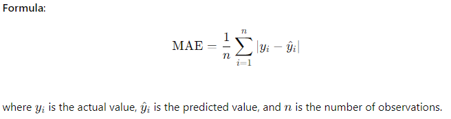
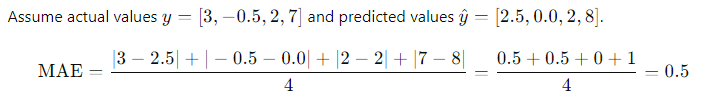
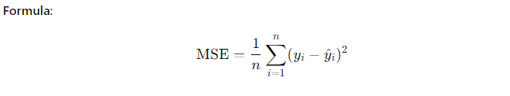
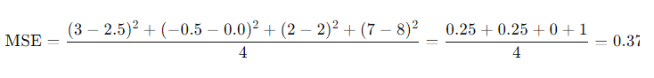
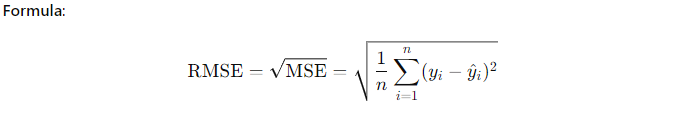
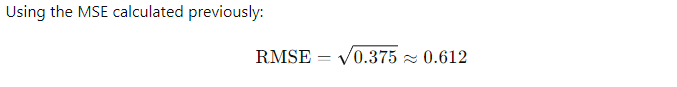
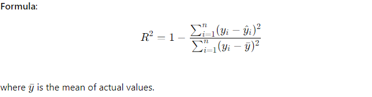
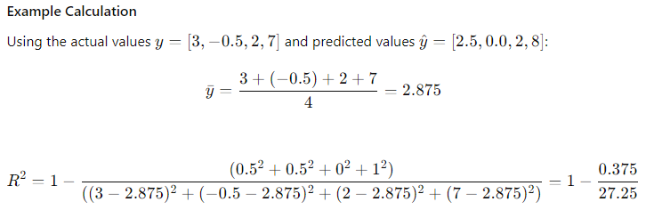
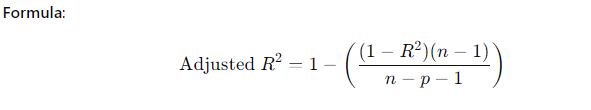
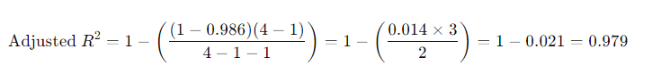

### Machine Learning Metrics: MAE, MSE, RMSE, R², and Adjusted R²

#### Overview
In machine learning, evaluating the performance of regression models requires various metrics that quantify the difference between predicted and actual values. Common metrics include Mean Absolute Error (MAE), Mean Squared Error (MSE), Root Mean Squared Error (RMSE), R-squared (R²), and Adjusted R-squared (Adjusted R²).

### Table of Contents

1. **Introduction to Regression Metrics**
   - Definition and Importance
   - Common Metrics for Regression

2. **Mean Absolute Error (MAE)**
   - Definition and Formula
   - Interpretation
   - Example Calculation    

3. **Mean Squared Error (MSE)**
   - Definition and Formula
   - Interpretation
   - Example Calculation

4. **Root Mean Squared Error (RMSE)**
   - Definition and Formula
   - Interpretation
   - Example Calculation

5. **R-squared (R²)**
   - Definition and Formula
   - Interpretation
   - Example Calculation

6. **Adjusted R-squared (Adjusted R²)**
   - Definition and Formula
   - Interpretation
   - Example Calculation

7. **Implementing Metrics in Python**
   - Using Scikit-Learn for Metric Calculations
   - Example: Evaluating a Regression Model

8. **Case Studies and Applications**
   - Real-World Example: House Price Prediction
   - Real-World Example: Predicting Stock Prices
   - Lessons Learned and Best Practices

### 1. Introduction to Regression Metrics

#### Definition and Importance
- **Regression Metrics**: Quantitative measures used to evaluate the performance of regression models.
- **Importance**: Helps in understanding how well the model predicts continuous outcomes and guides model improvement.

#### Common Metrics for Regression
- **MAE (Mean Absolute Error)**
- **MSE (Mean Squared Error)**
- **RMSE (Root Mean Squared Error)**
- **R² (R-squared)**
- **Adjusted R² (Adjusted R-squared)**

### 2. Mean Absolute Error (MAE)

#### Definition and Formula
- **MAE**: The average of the absolute differences between predicted and actual values.
- **Formula**: 


#### Interpretation
- **MAE**: Measures the average magnitude of errors in a set of predictions, without considering their direction.
- **Lower MAE**: Indicates a better fit.

#### Example Calculation


### 3. Mean Squared Error (MSE)

#### Definition and Formula
- **MSE**: The average of the squared differences between predicted and actual values.
- **Formula**: 


#### Interpretation
- **MSE**: Measures the average squared difference between predicted and actual values.
- **Lower MSE**: Indicates a better fit.

#### Example Calculation
Using the same actual and predicted values:



### 4. Root Mean Squared Error (RMSE)

#### Definition and Formula
- **RMSE**: The square root of the average of the squared differences between predicted and actual values.
- **Formula**: 


#### Interpretation
- **RMSE**: Measures the average magnitude of the error. It gives a higher weight to larger errors compared to MAE.
- **Lower RMSE**: Indicates a better fit.

#### Example Calculation
Using the MSE calculated previously:



### 5. R-squared (R²)

#### Definition and Formula
- **R²**: The proportion of the variance in the dependent variable that is predictable from the independent variables.
- **Formula**: 


#### Interpretation
- **R²**: Indicates the proportion of the variance explained by the model.
- **Range**: 0 to 1 (higher is better).

#### Example Calculation
Using the actual values \( y = [3, -0.5, 2, 7] \) and predicted values \( \hat{y} = [2.5, 0.0, 2, 8] \):



### 6. Adjusted R-squared (Adjusted R²)

#### Definition and Formula
- **Adjusted R²**: Adjusts the R² value based on the number of predictors in the model.
- **Formula**: 

  where \( n \) is the number of observations and \( p \) is the number of predictors.

#### Interpretation
- **Adjusted R²**: Provides a more accurate measure of model performance by penalizing the addition of irrelevant predictors.
- **Higher Adjusted R²**: Indicates a better fit.

#### Example Calculation
Using the R² calculated previously, and assuming \( n = 4 \) and \( p = 1 \):


### 7. Implementing Metrics in Python

#### Using Scikit-Learn for Metric Calculations

```python
from sklearn.metrics import mean_absolute_error, mean_squared_error, r2_score
import numpy as np

# Actual and predicted values
y_true = np.array([3, -0.5, 2, 7])
y_pred = np.array([2.5, 0.0, 2, 8])

# Mean Absolute Error
mae = mean_absolute_error(y_true, y_pred)
print(f"MAE: {mae}")

# Mean Squared Error
mse = mean_squared_error(y_true, y_pred)
print(f"MSE: {mse}")

# Root Mean Squared Error
rmse = np.sqrt(mse)
print(f"RMSE: {rmse}")

# R-squared
r2 = r2_score(y_true, y_pred)
print(f"R²: {r2}")

# Adjusted R-squared
n = len(y_true)
p = 1  # Number of predictors
adjusted_r2 = 1 - (1 - r2) * (n - 1) / (n - p - 1)
print(f"Adjusted R²: {adjusted_r2}")
```

### 8. Case Studies and Applications

#### Real-World Example: House Price Prediction
- **Dataset**: House price data with features like size, location, and number of bedrooms.
- **Model**: Linear regression model to predict house prices.
- **

Evaluation**: Use MAE, MSE, RMSE, R², and Adjusted R² to evaluate the model.

#### Real-World Example: Predicting Stock Prices
- **Dataset**: Historical stock prices with features like opening price, closing price, and trading volume.
- **Model**: Time-series forecasting model to predict future stock prices.
- **Evaluation**: Use MAE, MSE, RMSE, R², and Adjusted R² to evaluate the model.

#### Lessons Learned and Best Practices
- **Metric Selection**: Choose appropriate metrics based on the problem and data characteristics.
- **Model Comparison**: Use multiple metrics to compare different models and select the best one.
- **Interpretation**: Understand the meaning and implications of each metric for better model evaluation.

