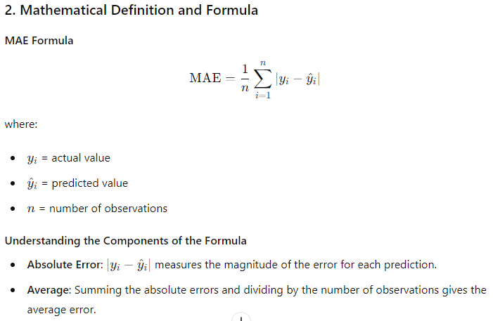
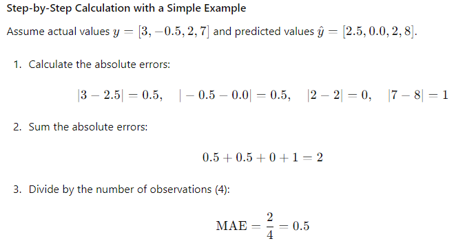

# Mean Absolute Error (MAE) in Machine Learning

#### Overview
Mean Absolute Error (MAE) is a commonly used metric for evaluating the performance of regression models. It measures the average magnitude of errors in a set of predictions, without considering their direction.

### Table of Contents

1. **Introduction to Mean Absolute Error (MAE)**
   - Definition and Purpose
   - Importance of MAE in Regression Analysis

2. **Mathematical Definition and Formula**
   - MAE Formula
   - Understanding the Components of the Formula

3. **Interpretation of MAE**
   - What MAE Tells Us
   - Comparing MAE with Other Metrics

4. **Example Calculation of MAE**
   - Step-by-Step Calculation with a Simple Example

5. **Implementing MAE in Python**
   - Using NumPy for Manual Calculation
   - Using Scikit-Learn for MAE Calculation

6. **Case Study: Predicting House Prices**
   - Dataset Description
   - Model Training and Prediction
   - Calculating and Interpreting MAE

7. **Lessons Learned and Best Practices**
   - When to Use MAE
   - Advantages and Limitations of MAE

### 1. Introduction to Mean Absolute Error (MAE)

#### Definition and Purpose
- **Mean Absolute Error (MAE)**: The average of the absolute differences between predicted and actual values.
- **Purpose**: To measure the accuracy of a regression model by quantifying the average magnitude of prediction errors.

#### Importance of MAE in Regression Analysis
- **Simplicity**: MAE is easy to understand and interpret.
- **Robustness**: MAE is less sensitive to outliers compared to metrics like Mean Squared Error (MSE).

### 2. Mathematical Definition and Formula



#### Understanding the Components of the Formula
- **Absolute Error**: \( |y_i - \hat{y}_i| \) measures the magnitude of the error for each prediction.
- **Average**: Summing the absolute errors and dividing by the number of observations gives the average error.

### 3. Interpretation of MAE

#### What MAE Tells Us
- **Magnitude of Errors**: MAE provides the average magnitude of prediction errors.
- **Model Accuracy**: Lower MAE values indicate a more accurate model.

#### Comparing MAE with Other Metrics
- **MAE vs. MSE**: MAE is less sensitive to outliers compared to MSE.
- **MAE vs. RMSE**: RMSE penalizes larger errors more than MAE.

### 4. Example Calculation of MAE

#### Step-by-Step Calculation with a Simple Example
Assume actual values \( y = [3, -0.5, 2, 7] \) and predicted values \( \hat{y} = [2.5, 0.0, 2, 8] \).



### 5. Implementing MAE in Python

#### Using NumPy for Manual Calculation

```python
import numpy as np

# Actual and predicted values
y_true = np.array([3, -0.5, 2, 7])
y_pred = np.array([2.5, 0.0, 2, 8])

# Calculate MAE manually
mae = np.mean(np.abs(y_true - y_pred))
print(f"MAE: {mae}")
```

#### Using Scikit-Learn for MAE Calculation

```python
from sklearn.metrics import mean_absolute_error

# Actual and predicted values
y_true = [3, -0.5, 2, 7]
y_pred = [2.5, 0.0, 2, 8]

# Calculate MAE using Scikit-Learn
mae = mean_absolute_error(y_true, y_pred)
print(f"MAE: {mae}")
```

### 6. Case Study: Predicting House Prices

#### Dataset Description
- **Dataset**: A dataset containing house features and their prices.
- **Features**: Size, number of bedrooms, location, etc.
- **Target Variable**: House price.

#### Model Training and Prediction

```python
from sklearn.model_selection import train_test_split
from sklearn.linear_model import LinearRegression
from sklearn.metrics import mean_absolute_error
import pandas as pd

# Load the dataset
# Assuming 'data' is a DataFrame containing the dataset
data = pd.read_csv('house_prices.csv')

# Features and target variable
X = data[['size', 'bedrooms', 'location']]
y = data['price']

# Split the data into training and testing sets
X_train, X_test, y_train, y_test = train_test_split(X, y, test_size=0.2, random_state=42)

# Train the model
model = LinearRegression()
model.fit(X_train, y_train)

# Predict on the test set
y_pred = model.predict(X_test)
```

#### Calculating and Interpreting MAE

```python
# Calculate MAE
mae = mean_absolute_error(y_test, y_pred)
print(f"MAE: {mae}")

# Interpretation
print(f"The average magnitude of prediction errors is {mae} dollars.")
```

### 7. Lessons Learned and Best Practices

#### When to Use MAE
- **Interpretability**: When you need an easily interpretable metric.
- **Outliers**: When the dataset contains outliers that you do not want to disproportionately affect the error metric.

#### Advantages and Limitations of MAE
- **Advantages**: Simple, easy to interpret, less sensitive to outliers.
- **Limitations**: Does not penalize large errors as much as squared error metrics like MSE or RMSE.

